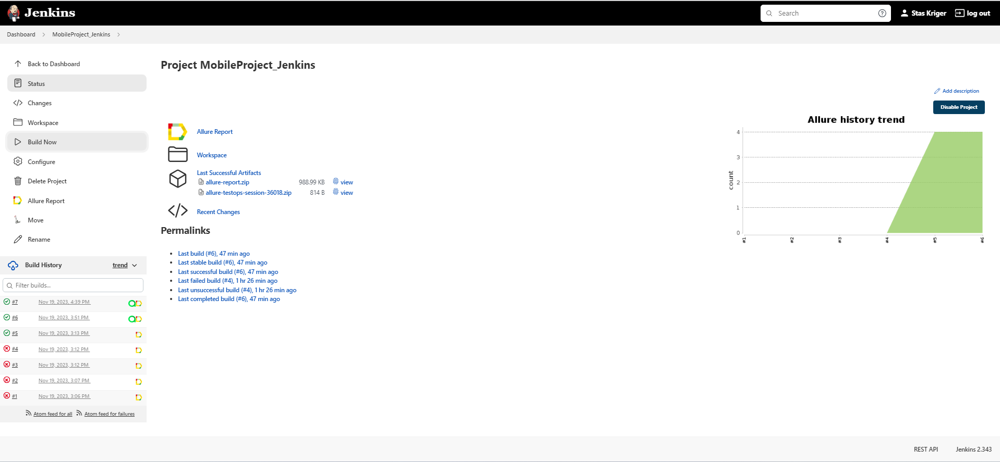
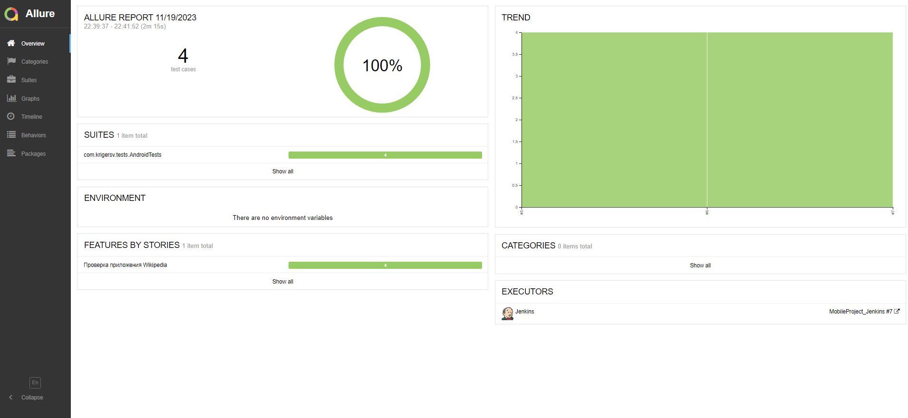
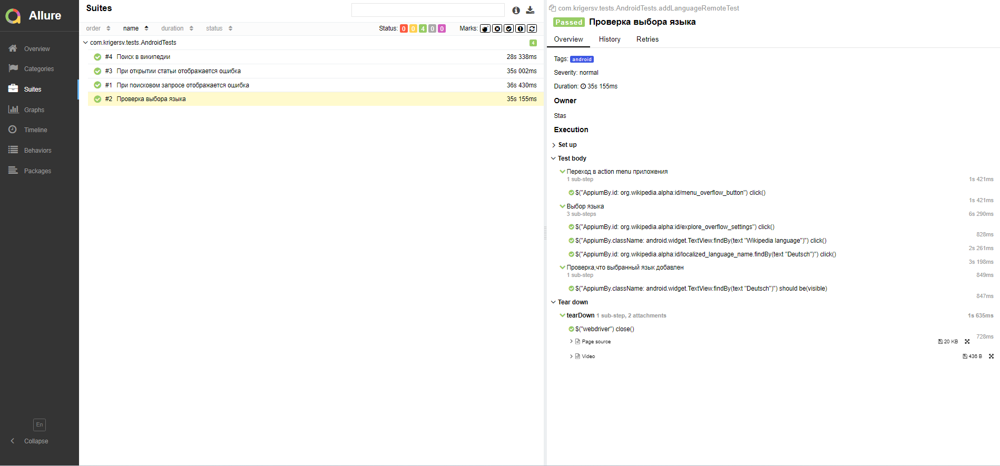
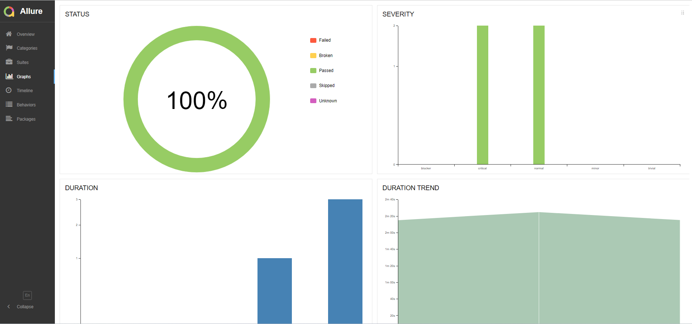
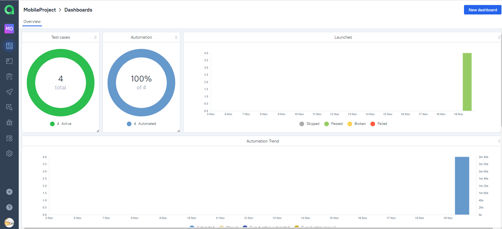
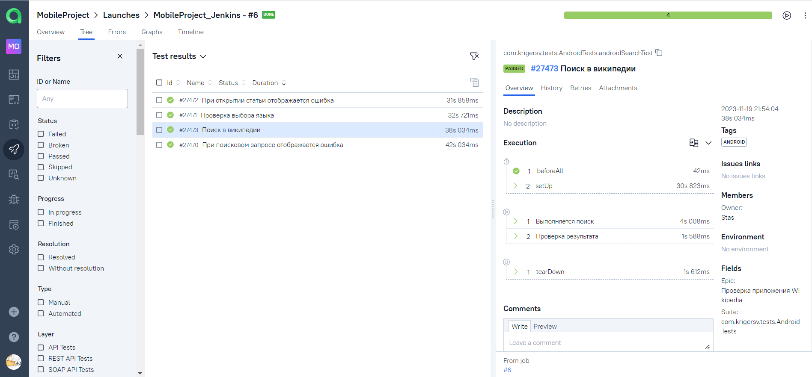
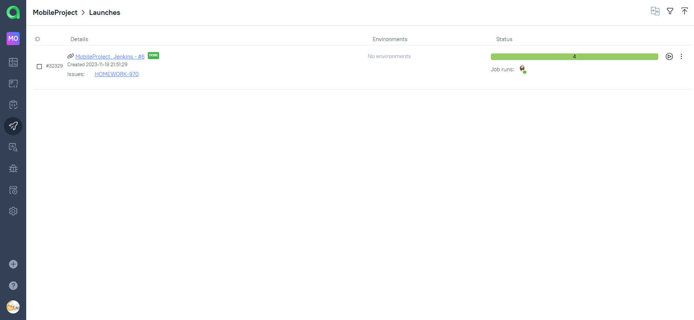
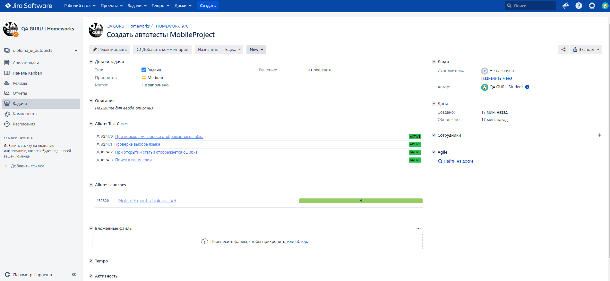
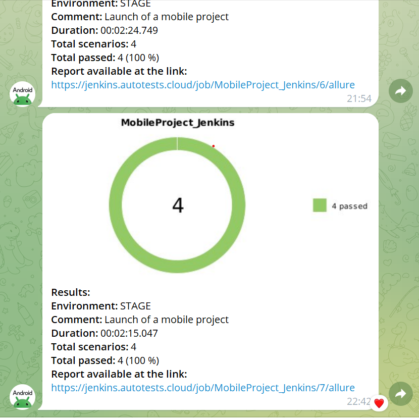
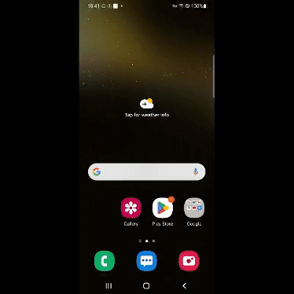

# Проект по автоматизации тестирования мобильного приложения [Wikipedia](https://ru.wikipedia.org/)

<p align="center"><a href="https://ru.wikipedia.org"></a></p>
Википедия — свободная общедоступная мультиязычная универсальная интернет-энциклопедия, которую может дополнять и редактировать каждый.
Здесь публикуются анонсы лучших статей Википедии на русском языке (а также некоторые Викиновости и избранные медиафайлы из Викисклада).

---

## :notebook: Содержание:

- [Стек технологий](#computer-стек-технологий)
- [Тестовые сценарии](#clipboard-тестовые-сценарии)
- [Сборка в Jenkins](#-сборка-в-jenkins)
- [Команда для запуска](#rocket-команда-для-запуска)
- [Allure отчет](#-allure-отчет)
- [Интеграция с Allure TestOps](#-интеграция-с-allure-testops)
- [Интеграция с Jira](#-интеграция-с-jira)
- [Уведомления в Telegram чат с ботом](#-уведомления-в-telegram-чат-с-ботом)
- [Видео запуска тестов в Selenoid](#-видео-запуска-тестов-в-selenoid)

---

## :computer: Стек технологий

<p align="left">
<a href="https://www.jetbrains.com/idea/"></a>
<a href="https://www.java.com/"></a>
<a href="https://github.com/"></a>
<a href="https://junit.org/junit5/"></a>
<a href="https://gradle.org/"></a>
<a href="https://selenide.org/"></a>
<a href="https://aerokube.com/selenoid/"></a>
<a href="https://github.com/allure-framework/allure2"></a>
<a href="https://qameta.io/"></a>
<a href="https://www.jenkins.io/"></a>
<a href="https://www.atlassian.com/ru/software/jira"></a>
<a href="https://www.telegram.org/"></a>
</p>

---

## :clipboard: Реализованные проверки:

[Проверка локального запуска ](https://github.com/StasK86/MobileProject_Diploma/blob/master/src/test/java/com/krigersv/tests/LocalTests.java)

- :white_check_mark: Поиск текста в википедии
- :white_check_mark: Проверка статьи
- :white_check_mark: Проверка страниц wiki
- :white_check_mark: Проверка выбора языка
- :white_check_mark: Проверка страницы авторизации

[Проверка удаленного запуска ](https://github.com/StasK86/MobileProject_Diploma/blob/master/src/test/java/com/krigersv/tests/AndroidTests.java)

- :white_check_mark: Поиск в википедии
- :white_check_mark: Проверка ошибки при открытии статьи
- :white_check_mark: Проверка выбора языка
- :white_check_mark: Проверка ошибки при поисковом запросе

---

## :rocket: Запуск автотестов:

#### Локальный запуск тестов из терминала:

```bash
gradle clean local -DdeviceHost=local
```

#### Удаленный запуск тестов в Browserstack:

```bash
gradle clean android -DdeviceHost=stack
```

###  Сборка в [Jenkins](https://jenkins.autotests.cloud/job/MobileProject_Jenkins/)

<p align="center">

</p>

---

##  [Allure](https://jenkins.autotests.cloud/job/MobileProject_Jenkins/7/allure/) отчет

### Главная страница отчета

<p align="center">

</p>

### Тест-кейсы

<p align="center">

</p>

### Графики

<p align="center">

</p>

---

##  Интеграция с [Allure TestOps](https://allure.autotests.cloud/project/3817/dashboards)

### Dashboards

<p align="center">

</p>

### Автоматизированные тест-кейсы

<p align="center">

</p>

### Запуск автоматизированных тестов в **TestOps**

<p align="center">

</p>

---

##  Интеграция с [Jira](https://jira.autotests.cloud/browse/HOMEWORK-970)

### Задача в Jira

<p align="center">

</p>

#### Содержание задачи

- :heavy_check_mark: Цель
- :heavy_check_mark: Задачи для выполнения
- :heavy_check_mark: Тест-кейсы из Allure TestOps
- :heavy_check_mark: Результат прогона тестов в Allure TestOps

---

##  Уведомления в Telegram чат с ботом


<p align="center">

</p>


---

##  Видео запуска тестов в Selenoid

<p align="center">

</p>

---


